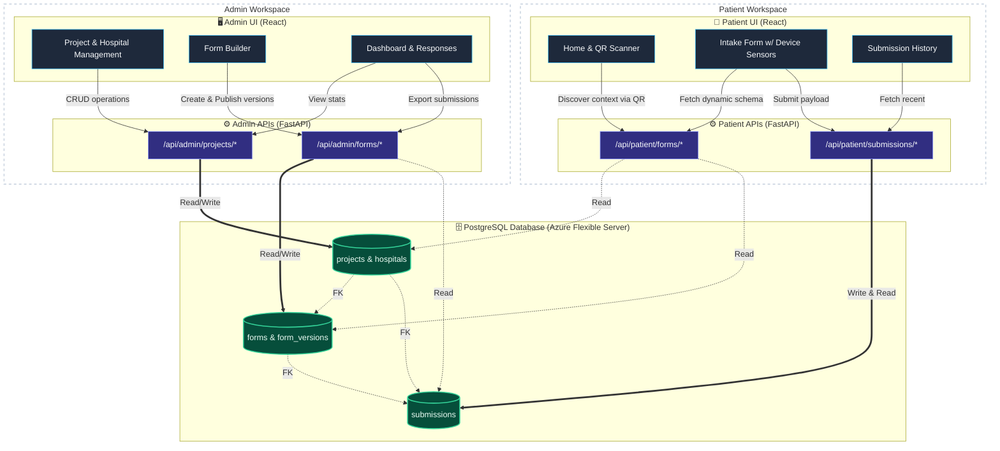

```mermaid
graph TD
    %% ─────────────────────────────────────────
    %% ADMIN FLOW
    %% ─────────────────────────────────────────
    subgraph ADMIN["Admin Workspace"]
        direction TB
        
        subgraph AdminUI["🖥️ Admin UI (React)"]
            A_Proj["Project & Hospital Management"]
            A_Form["Form Builder"]
            A_Resp["Dashboard & Responses"]
        end

        subgraph AdminAPI["⚙️ Admin APIs (FastAPI)"]
            API_Proj["/api/admin/projects/*"]
            API_Form["/api/admin/forms/*"]
        end

        A_Proj -->|CRUD operations| API_Proj
        A_Form -->|Create & Publish versions| API_Form
        A_Resp -->|View stats| API_Proj
        A_Resp -->|Export submissions| API_Form
    end

    %% ─────────────────────────────────────────
    %% PATIENT FLOW
    %% ─────────────────────────────────────────
    subgraph PATIENT["Patient Workspace"]
        direction TB
        
        subgraph PatientUI["📱 Patient UI (React)"]
            P_Home["Home & QR Scanner"]
            P_Intake["Intake Form w/ Device Sensors"]
            P_Hist["Submission History"]
        end

        subgraph PatientAPI["⚙️ Patient APIs (FastAPI)"]
            API_PForm["/api/patient/forms/*"]
            API_PSub["/api/patient/submissions/*"]
        end

        P_Home -->|Discover context via QR| API_PForm
        P_Intake -->|Fetch dynamic schema| API_PForm
        P_Intake -->|Submit payload| API_PSub
        P_Hist -->|Fetch recent| API_PSub
    end

    %% ─────────────────────────────────────────
    %% DATA LAYER
    %% ─────────────────────────────────────────
    subgraph DB["🗄️ PostgreSQL Database (Azure Flexible Server)"]
        direction LR
        TBL_P[("projects & hospitals")]
        TBL_F[("forms & form_versions")]
        TBL_S[("submissions")]
        
        TBL_P -.->|FK| TBL_F
        TBL_F -.->|FK| TBL_S
        TBL_P -.->|FK| TBL_S
    end

    %% Connections from API to DB
    API_Proj ==>|Read/Write| TBL_P
    API_Form ==>|Read/Write| TBL_F
    API_Form -.->|Read| TBL_S
    
    API_PForm -.->|Read| TBL_P
    API_PForm -.->|Read| TBL_F
    API_PSub ==>|Write & Read| TBL_S

    %% Styling
    classDef ui fill:#1e293b,stroke:#38bdf8,stroke-width:1px,color:#f8fafc
    classDef api fill:#312e81,stroke:#818cf8,stroke-width:1px,color:#f8fafc
    classDef db fill:#064e3b,stroke:#34d399,stroke-width:2px,color:#ecfdf5
    classDef workspace fill:transparent,stroke:#cbd5e1,stroke-width:2px,stroke-dasharray: 5 5

    class A_Proj,A_Form,A_Resp,P_Home,P_Intake,P_Hist ui
    class API_Proj,API_Form,API_PForm,API_PSub api
    class TBL_P,TBL_F,TBL_S db
    class ADMIN,PATIENT workspace
```
