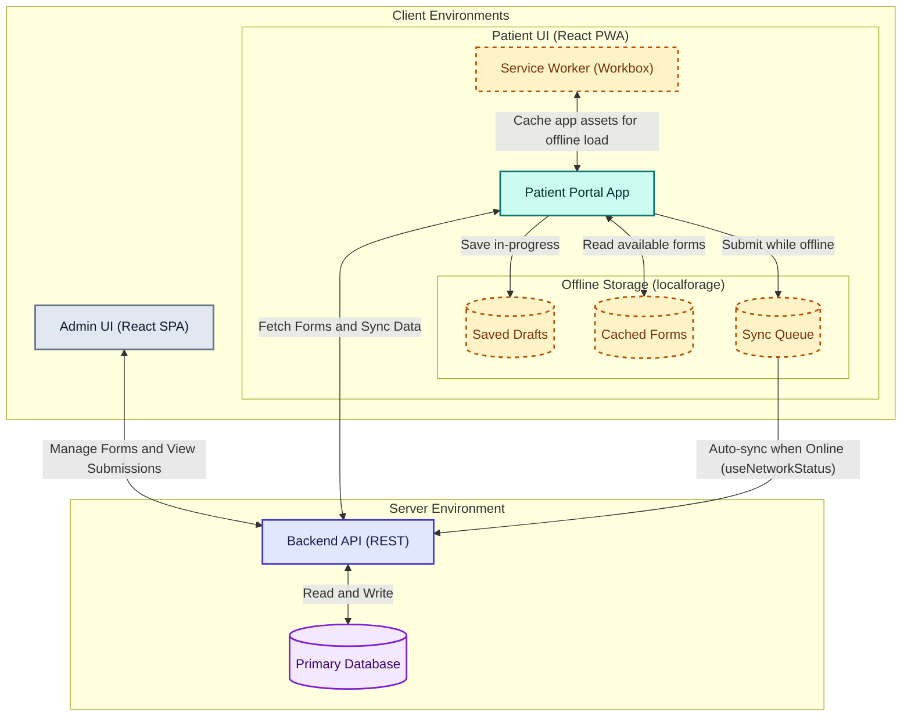

# HaloFormCraft High-Level Design (HLD)

This diagram outlines the high-level architecture of the HaloFormCraft system, highlighting the separation of concerns between the Admin and Patient portals, as well as the offline-first data flow of the Patient PWA.

### Key Components

> [!NOTE]
> **Admin UI (Standard SPA)**: A traditional React single-page application used by hospital staff on stable connections to create forms, manage templates, and review submitted patient data.

> [!TIP]
> **Patient UI (PWA)**: A Progressive Web App designed for reliability. It uses a Service Worker to cache the application shell and assets, allowing the app to load without an internet connection.

> [!IMPORTANT]
> **Offline Storage Strategy**: 
> - **Forms Cache**: Downloaded forms are stored locally so they can be rendered offline.
> - **Saved Drafts**: Patients can save partially completed forms locally.
> - **Sync Queue**: Completed forms submitted while offline are stored here until the `'online'` event is triggered, at which point `syncQueue.js` automatically pushes them to the backend API.
